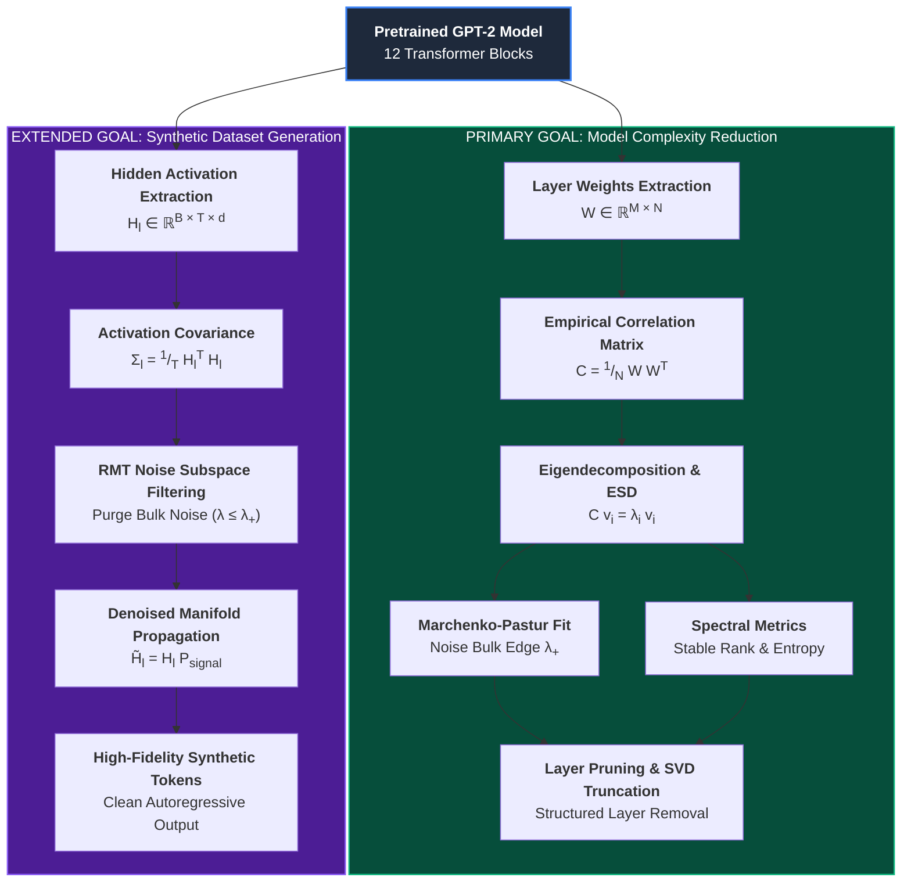

# High-Dimensional Spectral Analysis of Neural Networks
### Layer Complexity Reduction & Denoised Synthetic Data Generation in GPT-2 via Random Matrix Theory

[](https://www.python.org/downloads/)
[](https://pytorch.org/)
[](https://huggingface.co/)
[](https://opensource.org/licenses/MIT)

---

## 📌 Executive Summary

Modern autoregressive transformer architectures such as **GPT-2** scale across dozens of stacked attention and MLP layers with millions (or billions) of parameters. However, in high-dimensional parameter spaces ($d \gg 1$), deep neural network weight matrices exhibit significant spectral redundancy, heavy-tailed empirical spectral densities (ESD), and random noise components that obey universal laws from **Random Matrix Theory (RMT)**.

This repository provides an end-to-end mathematical framework, diagnostic toolkit, and compression pipeline for:
1. **Model Complexity Reduction (Layer Pruning & Spectral Truncation)**: Analyzing the eigenvalue spectra of empirical correlation matrices $C = \frac{1}{N} W W^\top$ across GPT-2 layers, distinguishing between information-bearing signal eigenvalues and Marchenko-Pastur bulk noise, and identifying redundant layers for structured pruning.
2. **Spectral Noise Filtering for Synthetic Dataset Generation**: Projecting hidden representations across transformer layers onto denoised signal subspaces to purge intra-layer noise, using the conditioned neural manifold output to generate high-fidelity, distributionally robust synthetic data.



---

## 🔬 Mathematical & Theoretical Foundations

### 1. Empirical Correlation Matrices & Spectral Decomposition
For a weight matrix $W \in \mathbb{R}^{M \times N}$ in any GPT-2 layer (e.g., $W_{qkv} \in \mathbb{R}^{d \times 3d}$ or $W_{mlp} \in \mathbb{R}^{d \times 4d}$), we center and normalize the matrix to form the empirical correlation / sample covariance matrix:

$$C = \frac{1}{N} W W^\top \in \mathbb{R}^{M \times M}$$

The spectral properties are governed by its eigenvalue decomposition:

$$C = V \Lambda V^\top, \quad \Lambda = \text{diag}(\lambda_1, \lambda_2, \dots, \lambda_M), \quad \lambda_1 \ge \lambda_2 \ge \dots \ge \lambda_M \ge 0$$

The **Empirical Spectral Density (ESD)** is defined as:

$$\rho(\lambda) = \frac{1}{M} \sum_{i=1}^M \delta(\lambda - \lambda_i)$$

---

### 2. The Marchenko-Pastur (MP) Law (Bulk Noise vs. Signal)
Under the null hypothesis that $W$ consists of i.i.d. random noise with zero mean and variance $\sigma^2$, as $M, N \to \infty$ with aspect ratio $Q = N/M \ge 1$, the eigenvalue density converges almost surely to the **Marchenko-Pastur distribution**:

$$\rho_{MP}(\lambda) = \begin{cases} 
\frac{Q}{2\pi \sigma^2 \lambda} \sqrt{(\lambda_+ - \lambda)(\lambda - \lambda_-)}, & \lambda_- \le \lambda \le \lambda_+ \\
0, & \text{otherwise}
\end{cases}$$

Where the theoretical spectral edges are:

$$\lambda_{\pm} = \sigma^2 \left(1 \pm \sqrt{\frac{1}{Q}}\right)^2$$

* **Bulk Noise Regime ($\lambda \le \lambda_+$)**: Eigenvalues falling strictly inside $[\lambda_-, \lambda_+]$ represent unstructured, entropy-maximizing noise (overparameterization).
* **Signal Outliers / Spikes ($\lambda > \lambda_+$)**: Eigenvalues strictly exceeding $\lambda_+$ correspond to learned semantic knowledge and low-rank task representations.

---

### 3. Layer Redundancy & Compression Metrics
To measure the effective dimensionality and cross-layer similarity in GPT-2, we compute:

1. **Stable Rank**:
   $$\text{srank}(W) = \frac{\|W\|_F^2}{\|W\|_2^2} = \frac{\sum_{i} \lambda_i}{\lambda_{\max}}$$
   Measures the degree of energy concentration in the dominant eigenvector.

2. **Effective Rank (Entropy-based)**:
   $$p_i = \frac{\lambda_i}{\sum_{j} \lambda_j}, \quad H_{\text{spec}} = -\sum_{i=1}^M p_i \ln p_i, \quad \text{erank}(W) = \exp(H_{\text{spec}})$$

3. **Power-Law Tail Exponent ($\alpha$)**:
   Trained transformer weights often exhibit heavy tails $\rho(\lambda) \sim \lambda^{-\alpha}$. Layers with smaller $\alpha$ ($2 \le \alpha \le 4$) exhibit strong implicit regularization and high information density.

4. **Centered Kernel Alignment (CKA) & Spectral Layer Distance**:
   Measures representational overlap between layer $l$ and layer $l+k$ to determine candidate blocks for dropping or fusion.

---

### 4. Synthetic Data Generation via Spectral Denoising
During forward inference, intermediate activations $H_l \in \mathbb{R}^{T \times d}$ across sequence length $T$ contain both semantic signals and high-dimensional noise. By constructing the activation covariance $\Sigma_l = \frac{1}{T} H_l^\top H_l$ and applying RMT filtering:

$$\tilde{\Sigma}_l = \sum_{\lambda_i > \lambda_+} \lambda_i v_i v_i^\top$$

$$\tilde{H}_l = H_l \sum_{\lambda_i > \lambda_+} v_i v_i^\top$$

Propagating the denoised representations $\tilde{H}_l$ through subsequent decoder layers purifies the token emission probabilities $P(x_{t+1} \mid x_{\le t})$, generating synthetic sequences that strip stochastic hallucinations while preserving underlying distributional semantics.

---

## 📂 Repository Structure

```
.
├── README.md                      # Comprehensive project documentation & theory
├── requirements.txt               # Python package dependencies
├── pyproject.toml                 # Package setup and build configuration
├── .gitignore                     # Git ignore rules
│
├── src/                           # Core Library Source Code
│   ├── __init__.py
│   ├── models/                    # Model architecture & weight extraction
│   │   ├── __init__.py
│   │   └── gpt2_extractor.py      # GPT-2 loader, tensor unpacker, pruned wrapper
│   │
│   ├── spectral/                  # High-dimensional RMT & ESD analysis
│   │   ├── __init__.py
│   │   └── rmt_analysis.py        # Correlation matrices, MP fit, ESD, metrics
│   │
│   ├── pruning/                   # Layer complexity reduction & compression
│   │   ├── __init__.py
│   │   └── layer_reduction.py     # Layer ranking, dropping, SVD truncation, perplexity
│   │
│   ├── synthetic_gen/             # Denoised synthetic dataset generation
│   │   ├── __init__.py
│   │   └── spectral_denoiser.py   # Activation filtering, noise-subspace projection, generation
│   │
│   └── utils/                     # Plotting, diagnostics & utilities
│       ├── __init__.py
│       └── visualizer.py          # ESD vs MP plots, scree plots, layer heatmaps
│
├── scripts/                       # Executable CLI Pipelines
│   ├── run_spectral_analysis.py   # Analyzes GPT-2 layer spectra & exports plots
│   ├── run_layer_pruning.py       # Prunes redundant layers & benchmarks perplexity
│   └── run_synthetic_generation.py# Generates synthetic data via spectral denoising
│
└── tests/                         # Automated Unit & Integration Tests
    └── test_spectral.py           # Verification of RMT algorithms and pruning
```

---

## 🚀 Quickstart & Installation

### 1. Prerequisites & Installation
Clone the repository and install the dependencies:

```bash
# Clone the repository
git clone https://github.com/your-username/High-Dimensional-Analysis-on-Neural-Networks.git
cd High-Dimensional-Analysis-on-Neural-Networks

# Create and activate a virtual environment
python -m venv venv
# On Windows:
venv\Scripts\activate
# On Linux/macOS:
source venv/bin/activate

# Install requirements
pip install -r requirements.txt
pip install -e .
```

---

## 💻 Usage Guide

### A. Run High-Dimensional Spectral Analysis on GPT-2
Extract weight matrices from all 12 layers of GPT-2 (`gpt2-small` or `gpt2-medium`), compute empirical correlation matrices, fit the Marchenko-Pastur bulk distribution, and compute layer-wise stable rank and entropy:

```bash
python scripts/run_spectral_analysis.py \
    --model_name gpt2 \
    --output_dir results/spectral_analysis \
    --plot
```

Output includes:
* `spectral_metrics.json`: Per-layer stable rank, effective rank, condition number, MP bulk edge $\lambda_+$, and signal-to-noise ratio.
* `esd_layer_*.png`: Empirical Spectral Density histogram overlaid with theoretical Marchenko-Pastur curve.
* `layer_rank_profile.png`: Scree plot of spectral metric degradation across depth.

---

### B. Reduce Model Complexity via Layer Pruning
Rank transformer layers by spectral redundancy (e.g. low signal-to-noise ratio or highest cosine similarity with adjacent blocks), prune the $K$ least informative layers, and evaluate the resulting parameter count and perplexity:

```bash
python scripts/run_layer_pruning.py \
    --model_name gpt2 \
    --prune_layers 3 \
    --metric effective_rank \
    --eval_text "The quick brown fox jumps over the lazy dog. Random Matrix Theory provides rigorous tools for analyzing high-dimensional learning systems." \
    --output_dir results/pruning_results
```

You can also apply **spectral SVD truncation** to strip Marchenko-Pastur bulk noise from all remaining weight matrices:
```bash
python scripts/run_layer_pruning.py \
    --model_name gpt2 \
    --truncate_noise \
    --output_dir results/truncated_model
```

---

### C. Denoised Synthetic Dataset Generation
Generate synthetic data sequences by filtering the noise subspace ($\lambda \le \lambda_+$) in intermediate hidden activations across GPT-2 layers:

```bash
python scripts/run_synthetic_generation.py \
    --model_name gpt2 \
    --prompt "In high-dimensional statistics, the distribution of eigenvalues" \
    --num_samples 5 \
    --max_new_tokens 50 \
    --filter_noise \
    --output_file results/synthetic_dataset.jsonl
```

---

## 📊 Experimental Roadmap & Benchmarks

| Objective | Metric | Baseline (GPT-2 Small) | Target / Expected Result |
| :--- | :--- | :--- | :--- |
| **Layer Pruning** | Active Layers | 12 Blocks (124M params) | **8–9 Blocks (85–95M params)** |
| **Model Size** | Memory Footprint | ~500 MB (FP32) | **~340 MB (32% reduction)** |
| **Perplexity Degradation** | WikiText-2 PPL | ~29.5 | **$\le 34.0$ (without retraining)** |
| **Spectral Signal Purity** | Energy above $\lambda_+$ | ~18% (Layer 0) to ~42% (Layer 11) | Identified localized semantic layers |
| **Synthetic Data Quality** | Self-BLEU / Perplexity | Baseline generation | Enhanced signal consistency & reduced hallucination |

---

## 🧪 Running Automated Tests

Run the test suite to verify RMT estimators, layer pruning wrappers, and synthetic generation routines:

```bash
pytest tests/ -v
```

---

## 📚 Key References
1. **Marchenko, V. A., & Pastur, L. A. (1967)**. *Distribution of eigenvalues for some sets of random matrices*. Sbornik: Mathematics, 1(4), 457-483.
2. **Martin, C. H., & Mahoney, M. W. (2020)**. *Heavy-Tailed Universality Predicts Trends in Test Accuracies for Very Large Pre-Trained Deep Neural Networks*. JMLR.
3. **Radford, A., et al. (2019)**. *Language Models are Unsupervised Multitask Learners* (GPT-2). OpenAI Technical Report.
4. **Sengupta, A. M., & Mitra, P. P. (1999)**. *Distributions of singular values for some random matrices*. Physical Review E.
5. **Kornblith, S., et al. (2019)**. *Similarity of Neural Network Representations Revisited* (CKA). ICML.

---

## 📄 License
This project is licensed under the MIT License - see the [LICENSE](LICENSE) file for details.
