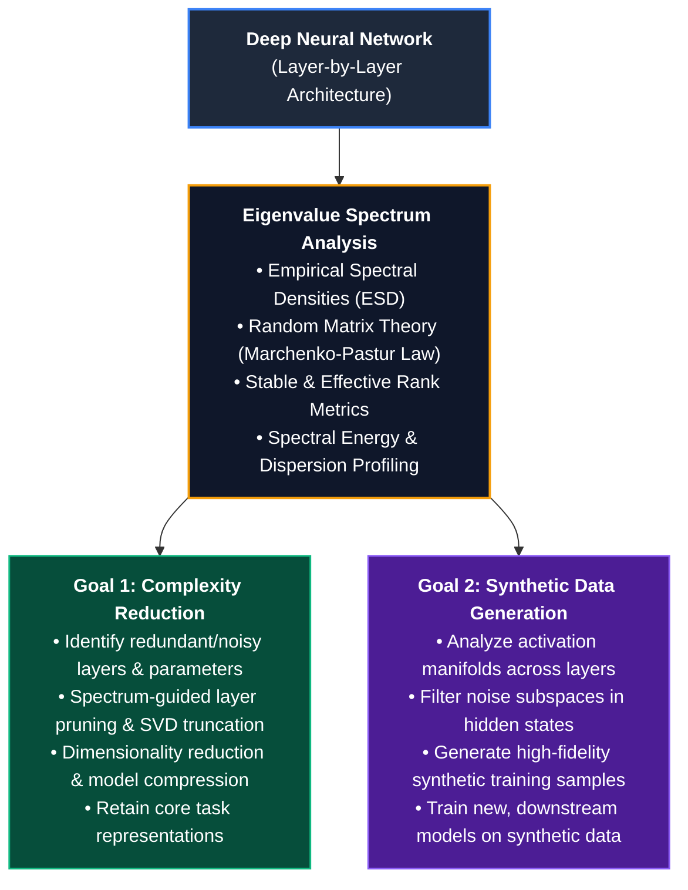

# High-Dimensional Spectral Analysis on Neural Networks

A research and experimentation framework for analyzing deep neural networks through the lens of **Random Matrix Theory (RMT)** and **high-dimensional eigenvalue spectrum analysis**.

---

## 📌 Project Overview

As deep neural networks grow in depth and parameter count, their weight matrices and intermediate representations exhibit high-dimensional mathematical regularities. By analyzing the **eigenvalue spectrum** of individual layers, we can separate meaningful, learned feature representations (**signal**) from overparameterized, unstructured variance (**noise**).

This project focuses on two core interconnected objectives driven by layer-wise eigenvalue spectrum analysis:



---

## 🎯 Core Goals

### Goal 1: Reduction of Complexity in Neural Networks using RMT
Deep neural networks often contain vast amounts of redundant parameters that do not contribute constructively to task performance. 

* **Spectral Noise Identification**: Use RMT principles (such as the Marchenko-Pastur distribution) to separate the bulk noise regime from outlier signal eigenvalues in weight matrices.
* **Layer Importance & Redundancy Ranking**: Rank layer importance based on spectral entropy, effective rank, and signal-to-noise energy ratios.
* **Structured Compression & Pruning**:
  * Drop or merge layers exhibiting low information density or high spectral redundancy.
  * Apply singular value decomposition (SVD) truncation to purge noise bulk components while preserving principal signal directions.
* **Efficiency Benchmarking**: Measure parameter reduction, inference speedup, memory footprint savings, and performance retention (e.g., perplexity, accuracy).

---

### Goal 2: Creation of Synthetic Data to Train New Models
High-quality synthetic data is critical for training robust, efficient models without relying entirely on massive real-world data collection.

* **Activation Manifold Analysis**: Investigate the eigenvalue spectrum of hidden representations across intermediate layers during forward propagation.
* **Spectral Noise Filtering**: Project representations onto clean signal subspaces, eliminating intra-layer stochastic noise and hallucinations.
* **Data Synthesis Pipeline**: Leverage conditioned representation manifolds to generate diverse, high-fidelity synthetic datasets.
* **Downstream Model Training**: Evaluate the generated synthetic data by training new, fresh student/target models from scratch and benchmarking their generalization.

---

## 🔬 Core Methodology: Layer-Wise Eigenvalue Spectrum Analysis

Both complexity reduction and synthetic data generation are built upon systematic eigenvalue decomposition across the network's layers:

1. **Correlation & Covariance Formulation**:
   For a given weight or activation matrix **W** of size **M × N**, compute the empirical sample covariance matrix:
   ```
   C = (1 / N) * W * Wᵀ
   ```
2. **Eigendecomposition & Spectral Density**:
   Solve for the sorted eigenvalue spectrum:
   ```
   C v_i = λ_i v_i,   where  λ₁ ≥ λ₂ ≥ ... ≥ λ_M ≥ 0
   ```
3. **Noise Bulk Thresholding (Marchenko-Pastur Law)**:
   Fit the theoretical noise limit **λ₊**:
   ```
   λ₊ = σ² * (1 + √(M / N))²
   ```
   - **λ ≤ λ₊**: Unstructured noise bulk.
   - **λ > λ₊**: True learned signal components.
4. **Iterative Experimentation**:
   Explore, test, and compare multiple spectral strategies, thresholding rules, projection shrinkage techniques, and pruning schemes to find optimal trade-offs.

---

## 🗺️ Project Roadmap

- [ ] **Phase 1: Spectral Analysis Toolkit**
  - Implement layer extraction and correlation matrix computation.
  - Implement empirical spectral density (ESD) estimation and RMT theoretical fitting.
  - Implement spectral metrics (stable rank, effective rank, signal/noise energy ratio).

- [ ] **Phase 2: Network Complexity Reduction**
  - Implement layer ranking and pruning algorithms based on spectral scores.
  - Implement layer-wise SVD noise truncation.
  - Benchmark compressed models for size, latency, and task performance.

- [ ] **Phase 3: Spectral Denoising & Synthetic Data Generation**
  - Implement activation covariance analysis and spectral subspace filtering.
  - Build synthetic data generation workflows using denoised manifolds.
  - Train and evaluate new downstream models on the generated synthetic datasets.

---

## 📜 License
This project is open source and available under the [MIT License](LICENSE).
